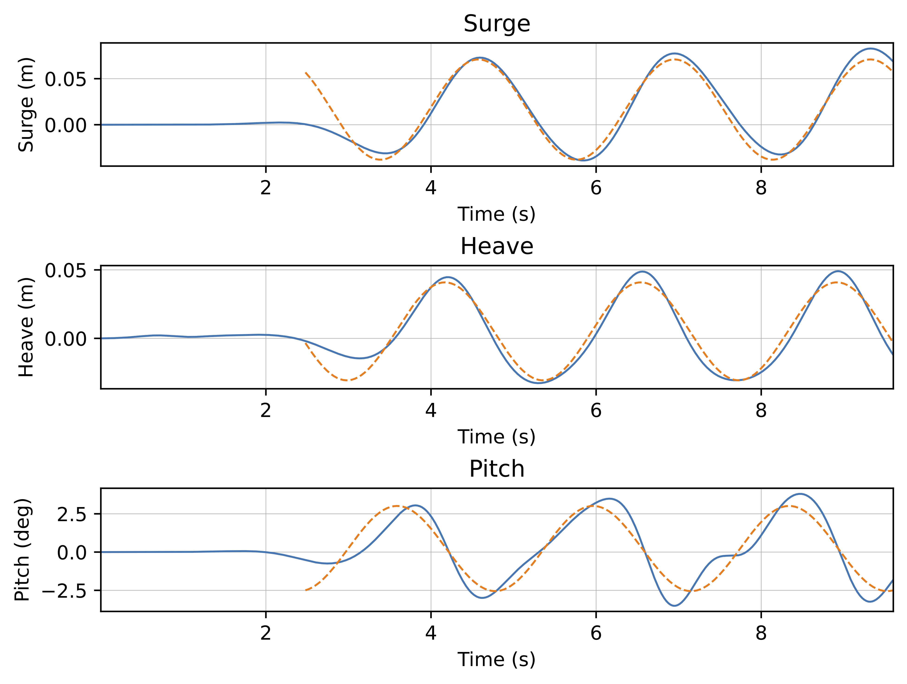

# Table of Contents

1.  [研究目的](#org7651b92)
2.  [基準模擬條件概述](#org684ccf0)
    1.  [模擬區域設定](#org5d070cd)
    2.  [基礎浮體條件](#orged1d07a)
    3.  [基礎繫泊條件](#org1afca18)
    4.  [Chen and Hall (2022) 之波浪條件](#org74ce95a)
3.  [計算條件設定](#org29292bf)
    1.  [浮體幾何與波浪參數計算程式](#org64c7c43)
    2.  [第一組 (基準案例)](#org82534e4)
    3.  [第二組 (較大波高)](#org8d56b0f)
    4.  [第三組 (寬浮體)](#org73e4465)
4.  [波浪參數意義與物理說明](#org5ea2285)
    1.  [波浪週期 T](#org16c1710)
    2.  [波高 H](#org5f1b1b0)
    3.  [波長 L](#org45f74c0)
    4.  [波陡度 H/L](#orgae601c2)
    5.  [水深 h](#org931b8f5)
5.  [RAO 的意義與計算](#orgb85553f)
    1.  [RAO 的基本定義](#org99fbceb)
    2.  [三個自由度的 RAO 定義](#orgd23c03d)
    3.  [實際計算步驟](#orgeecb751)
        1.  [輸入波參數](#orgca3107e)
        2.  [FFT 分析](#org665e3b1)
        3.  [最小平方法擬合](#orgff2076a)
        4.  [計算 RAO](#orgf17c390)
    4.  [結果解讀](#orgd5e0f52)
6.  [實驗步驟建議](#orgb23ee9b)
7.  [分析與討論方向](#orgc100ca4)
8.  [學習重點](#orge2e8f49)
9.  [延伸方向](#org6ac2168)
10. [Overset 計算執行](#orga7a0980)
    1.  [計算指令](#org4359ba5)
    2.  [平行計算設定](#orgcba86c4)
    3.  [計算分割數](#orgbe5204e)
11. [ParaView 繪圖與前後處理](#org5ce1e03)
    1.  [ParaView 繪圖](#org54fa33b)
        1.  [直接開啟 `state` 檔](#orge55b8ba)
        2.  [波浪流場與物體繪製流程](#org6e99885)
        3.  [繪製繫纜線](#org3683dd7)
    2.  [ParaView 動畫輸出](#org0dbe9de)
        1.  [安裝 ffmpeg](#orgc2b92b5)
        2.  [OpenFOAM 輸出動畫影格](#orgc8d01a9)
        3.  [使用 ffmpeg 合成影片](#orge49c2db)
        4.  [可選：影片壓縮與縮放](#org37d1eba)
        5.  [提示](#orgdced80d)
    3.  [前、後處理之 Python 程式碼](#orgdfd9027)
    4.  [附註： Jupyter Notebook 安裝方法](#org07a624f)
12. [成果報告](#org28786d8)
    1.  [內容架構](#orga7f85f7)
    2.  [成果呈現參考資訊](#orga7b739e)
        1.  [基本方程式與數值方法](#org099b1af)
13. [參考文獻](#orgaa747e0)

# 研究目的

本專題以 **foamMooring** 工具箱為基礎，模擬單一矩形浮體（floating body）在不同波浪條件下的運動響應。
藉由系統性地改變波浪週期與波高，分析浮體在三自由度運動（3-DoF） 下的 **RAO（Response Amplitude Operator）**
特性，了解浮體對波浪頻率的動態反應，並探討共振現象與繫泊系統的影響。

研究結果可作為：

1.  浮體動力行為的初步驗證；
2.  對照不同繫泊剛度或幾何設定的參考；
3.  後續延伸研究（例如多浮體干涉、風浪耦合等）的基礎資料。

# 基準模擬條件概述

根據 Chen and Hall (2022) 的單一浮體案例，本研究採用相同的幾何、繫泊與水槽條件，改變波浪週期與波高兩個主要參數。

## 模擬區域設定

 之模擬區域示意圖 (3D)。")

模擬區域為上圖 (Chen and Hall, 2022) 之二維版本，亦即 y 方向設為均勻。

## 基礎浮體條件

-   浮體之 x 方向寬度 $2b = 0.2~\mathrm{m}$
-   浮體之 y 方向跨度 $0.2~\mathrm{m}$
-   浮體之 z 方向高度 $0.132~\mathrm{m}$
-   初始吃水深度 $d = 0.0786~\mathrm{m}$
-   初始出水深度 $d' = 0.0534~\mathrm{m}$
-   浮體質量 $3.16~\mathrm{kg}$
-   質量中心 $(x, y, z) = (0, 0, -0.0126)~\mathrm{m}$
-   浮體慣性矩 (Ixx, Iyy, Izz) = $(0.015, 0.015, 0.021)~\mathrm{kg\, m^2}$
-   靜止水深 $h = 0.5~\mathrm{m}$

## 基礎繫泊條件

-   繫纜單位長度質量 $0.607~\mathrm{g/cm} = 0.0607~\mathrm{kg/m}$
-   繫纜直徑 $0.003656~\mathrm{m}$
-   繫纜長度 $1.455~\mathrm{m}$
-   繫纜軸向剛度 (axial stiffness) $29~\mathrm{N}$
-   繫纜導纜器 (fairlead, 與浮體連接處) $(x, y, z) = (\pm 0.1, \pm 0.1, -0.0736)~\mathrm{m}$
-   繫纜錨定處 (ahcnor, 與底床連接處) $(x, y, z) = (\pm 1.385, \pm 0.423, -0.5)~\mathrm{m}$

## Chen and Hall (2022) 之波浪條件

<table border="2" cellspacing="0" cellpadding="6" rules="groups" frame="hsides">

<colgroup>
<col  class="org-left" />

<col  class="org-right" />

<col  class="org-right" />

<col  class="org-right" />

<col  class="org-right" />

<col  class="org-right" />
</colgroup>
<thead>
<tr>
<th scope="col" class="org-left">編號</th>
<th scope="col" class="org-right">週期 T (s)</th>
<th scope="col" class="org-right">波高 H (m)</th>
<th scope="col" class="org-right">波長 L (m)</th>
<th scope="col" class="org-right">波尖銳度 H/L</th>
<th scope="col" class="org-right">相對水深 h/L</th>
</tr>
</thead>

<tbody>
<tr>
<td class="org-left">H12T18</td>
<td class="org-right">1.8</td>
<td class="org-right">0.12</td>
<td class="org-right">3.57</td>
<td class="org-right">0.0336</td>
<td class="org-right">0.140</td>
</tr>

<tr>
<td class="org-left">H12T20</td>
<td class="org-right">2.0</td>
<td class="org-right">0.12</td>
<td class="org-right">4.06</td>
<td class="org-right">0.0296</td>
<td class="org-right">0.123</td>
</tr>

<tr>
<td class="org-left">H15T18</td>
<td class="org-right">1.8</td>
<td class="org-right">0.15</td>
<td class="org-right">3.57</td>
<td class="org-right">0.0420</td>
<td class="org-right">0.140</td>
</tr>
</tbody>
</table>

以相對水深 $(h/L)$ 來分類，以上波浪均屬中間水深波 (intermediate water waves)。波浪尖銳度 (wave steepness) $H/L$ 與波浪的非線性程度有關，但並非一個獨立的分類指標。相對水深之分類為：

-   深水波: $h/L > 1/2$
-   中間水深波: $1/20 < h/L < 1/2$
-   淺水波: $h/L < 1/20$

# 計算條件設定

## 浮體幾何與波浪參數計算程式

-   浮體幾何條件：見資料夾 `tools/` 中的 [floating body.ipynb](./tools/floating_body.ipynb)。
-   波浪條件：見資料夾 `tools/` 中的 [DispersionEq.ipynb](./tools/DispersionEq.ipynb)。

## 第一組 (基準案例)

依據 Chen and Hall (2022) 基礎模擬條件，設置靜水深 $h = 0.5~\mathrm{m}$, 浮體半寬 $b = 0.1~\mathrm{m}$。

-   浮體寬深比 $b/d = 1.2723$
-   浮體出水/吃水深比 $d'/d = 0.6794$
-   浮體寬度水深比 $b/h = 0.2$
-   浮體吃水深與靜水深比 $d/h = 0.1572$

其他參數為：

    Water density rho_w = 1000.0 kg/m³
    Computed solid density rho_s = 595.455 kg/m³
    Geometric center z_c = -0.01260 m (measured from still water surface)
    Mass m = 3.14400 kg
    Ixx = 0.01505 kg·m²
    Iyy = 0.01505 kg·m²
    Izz = 0.02096 kg·m²

以波數 (wave number) $k = 2\pi/L$ 之倒數為長度之無因次尺度，其中 $L$ 為波長。改變波浪週期 $T$ 可得到不同之 $k$ 值。
規劃相對之浮體寬為 $kb = 0.3 \sim 1.2$, 波浪尖銳度 $ka = 0.05, 0.1$, 其中 $a = H/2$ 為入射波振幅。
計算例設定如下表：

<table border="2" cellspacing="0" cellpadding="6" rules="groups" frame="hsides">

<colgroup>
<col  class="org-right" />

<col  class="org-right" />

<col  class="org-right" />

<col  class="org-right" />

<col  class="org-right" />

<col  class="org-right" />
</colgroup>
<thead>
<tr>
<th scope="col" class="org-right">No.</th>
<th scope="col" class="org-right">kb</th>
<th scope="col" class="org-right">ka</th>
<th scope="col" class="org-right">H (m)</th>
<th scope="col" class="org-right">L (m)</th>
<th scope="col" class="org-right">T (s)</th>
</tr>
</thead>

<tbody>
<tr>
<td class="org-right">1</td>
<td class="org-right">0.30</td>
<td class="org-right">0.05</td>
<td class="org-right">0.0333</td>
<td class="org-right">2.0944</td>
<td class="org-right">1.217</td>
</tr>

<tr>
<td class="org-right">2</td>
<td class="org-right">0.40</td>
<td class="org-right">0.05</td>
<td class="org-right">0.0250</td>
<td class="org-right">1.5708</td>
<td class="org-right">1.022</td>
</tr>

<tr>
<td class="org-right">3</td>
<td class="org-right">0.50</td>
<td class="org-right">0.05</td>
<td class="org-right">0.0200</td>
<td class="org-right">1.2566</td>
<td class="org-right">0.903</td>
</tr>

<tr>
<td class="org-right">4</td>
<td class="org-right">0.60</td>
<td class="org-right">0.05</td>
<td class="org-right">0.0167</td>
<td class="org-right">1.0472</td>
<td class="org-right">0.821</td>
</tr>

<tr>
<td class="org-right">5</td>
<td class="org-right">0.70</td>
<td class="org-right">0.05</td>
<td class="org-right">0.0143</td>
<td class="org-right">0.8976</td>
<td class="org-right">0.759</td>
</tr>

<tr>
<td class="org-right">6</td>
<td class="org-right">0.80</td>
<td class="org-right">0.05</td>
<td class="org-right">0.0125</td>
<td class="org-right">0.7854</td>
<td class="org-right">0.709</td>
</tr>

<tr>
<td class="org-right">7</td>
<td class="org-right">0.90</td>
<td class="org-right">0.05</td>
<td class="org-right">0.0111</td>
<td class="org-right">0.6981</td>
<td class="org-right">0.669</td>
</tr>

<tr>
<td class="org-right">8</td>
<td class="org-right">1.00</td>
<td class="org-right">0.05</td>
<td class="org-right">0.0100</td>
<td class="org-right">0.6283</td>
<td class="org-right">0.634</td>
</tr>

<tr>
<td class="org-right">9</td>
<td class="org-right">1.10</td>
<td class="org-right">0.05</td>
<td class="org-right">0.0091</td>
<td class="org-right">0.5712</td>
<td class="org-right">0.605</td>
</tr>

<tr>
<td class="org-right">10</td>
<td class="org-right">1.20</td>
<td class="org-right">0.05</td>
<td class="org-right">0.0083</td>
<td class="org-right">0.5236</td>
<td class="org-right">0.579</td>
</tr>

<tr>
<td class="org-right">11</td>
<td class="org-right">0.30</td>
<td class="org-right">0.10</td>
<td class="org-right">0.0667</td>
<td class="org-right">2.0944</td>
<td class="org-right">1.217</td>
</tr>

<tr>
<td class="org-right">12</td>
<td class="org-right">0.40</td>
<td class="org-right">0.10</td>
<td class="org-right">0.0500</td>
<td class="org-right">1.5708</td>
<td class="org-right">1.022</td>
</tr>

<tr>
<td class="org-right">13</td>
<td class="org-right">0.50</td>
<td class="org-right">0.10</td>
<td class="org-right">0.0400</td>
<td class="org-right">1.2566</td>
<td class="org-right">0.903</td>
</tr>

<tr>
<td class="org-right">14</td>
<td class="org-right">0.60</td>
<td class="org-right">0.10</td>
<td class="org-right">0.0333</td>
<td class="org-right">1.0472</td>
<td class="org-right">0.821</td>
</tr>

<tr>
<td class="org-right">15</td>
<td class="org-right">0.70</td>
<td class="org-right">0.10</td>
<td class="org-right">0.0286</td>
<td class="org-right">0.8976</td>
<td class="org-right">0.759</td>
</tr>

<tr>
<td class="org-right">16</td>
<td class="org-right">0.80</td>
<td class="org-right">0.10</td>
<td class="org-right">0.0250</td>
<td class="org-right">0.7854</td>
<td class="org-right">0.709</td>
</tr>

<tr>
<td class="org-right">17</td>
<td class="org-right">0.90</td>
<td class="org-right">0.10</td>
<td class="org-right">0.0222</td>
<td class="org-right">0.6981</td>
<td class="org-right">0.669</td>
</tr>

<tr>
<td class="org-right">18</td>
<td class="org-right">1.00</td>
<td class="org-right">0.10</td>
<td class="org-right">0.0200</td>
<td class="org-right">0.6283</td>
<td class="org-right">0.634</td>
</tr>

<tr>
<td class="org-right">19</td>
<td class="org-right">1.10</td>
<td class="org-right">0.10</td>
<td class="org-right">0.0182</td>
<td class="org-right">0.5712</td>
<td class="org-right">0.605</td>
</tr>

<tr>
<td class="org-right">20</td>
<td class="org-right">1.20</td>
<td class="org-right">0.10</td>
<td class="org-right">0.0167</td>
<td class="org-right">0.5236</td>
<td class="org-right">0.579</td>
</tr>
</tbody>
</table>

## 第二組 (較大波高)

設定波浪尖銳度 $ka = 0.1, 0.2$, 其餘條件如第一組。計算例設定如下表：

<table border="2" cellspacing="0" cellpadding="6" rules="groups" frame="hsides">

<colgroup>
<col  class="org-right" />

<col  class="org-right" />

<col  class="org-right" />

<col  class="org-right" />

<col  class="org-right" />

<col  class="org-right" />
</colgroup>
<thead>
<tr>
<th scope="col" class="org-right">No.</th>
<th scope="col" class="org-right">kb</th>
<th scope="col" class="org-right">ka</th>
<th scope="col" class="org-right">H (m)</th>
<th scope="col" class="org-right">L (m)</th>
<th scope="col" class="org-right">T (s)</th>
</tr>
</thead>

<tbody>
<tr>
<td class="org-right">21</td>
<td class="org-right">0.30</td>
<td class="org-right">0.20</td>
<td class="org-right">0.1333</td>
<td class="org-right">2.0944</td>
<td class="org-right">1.217</td>
</tr>

<tr>
<td class="org-right">22</td>
<td class="org-right">0.40</td>
<td class="org-right">0.20</td>
<td class="org-right">0.1000</td>
<td class="org-right">1.5708</td>
<td class="org-right">1.022</td>
</tr>

<tr>
<td class="org-right">23</td>
<td class="org-right">0.50</td>
<td class="org-right">0.20</td>
<td class="org-right">0.0800</td>
<td class="org-right">1.2566</td>
<td class="org-right">0.903</td>
</tr>

<tr>
<td class="org-right">24</td>
<td class="org-right">0.60</td>
<td class="org-right">0.20</td>
<td class="org-right">0.0667</td>
<td class="org-right">1.0472</td>
<td class="org-right">0.821</td>
</tr>

<tr>
<td class="org-right">25</td>
<td class="org-right">0.70</td>
<td class="org-right">0.20</td>
<td class="org-right">0.0571</td>
<td class="org-right">0.8976</td>
<td class="org-right">0.759</td>
</tr>

<tr>
<td class="org-right">26</td>
<td class="org-right">0.80</td>
<td class="org-right">0.20</td>
<td class="org-right">0.0500</td>
<td class="org-right">0.7854</td>
<td class="org-right">0.709</td>
</tr>

<tr>
<td class="org-right">27</td>
<td class="org-right">0.90</td>
<td class="org-right">0.20</td>
<td class="org-right">0.0444</td>
<td class="org-right">0.6981</td>
<td class="org-right">0.669</td>
</tr>

<tr>
<td class="org-right">28</td>
<td class="org-right">1.00</td>
<td class="org-right">0.20</td>
<td class="org-right">0.0400</td>
<td class="org-right">0.6283</td>
<td class="org-right">0.634</td>
</tr>

<tr>
<td class="org-right">29</td>
<td class="org-right">1.10</td>
<td class="org-right">0.20</td>
<td class="org-right">0.0364</td>
<td class="org-right">0.5712</td>
<td class="org-right">0.605</td>
</tr>

<tr>
<td class="org-right">30</td>
<td class="org-right">1.20</td>
<td class="org-right">0.20</td>
<td class="org-right">0.0333</td>
<td class="org-right">0.5236</td>
<td class="org-right">0.579</td>
</tr>

<tr>
<td class="org-right">31</td>
<td class="org-right">0.30</td>
<td class="org-right">0.50</td>
<td class="org-right">0.3333</td>
<td class="org-right">2.0944</td>
<td class="org-right">1.217</td>
</tr>

<tr>
<td class="org-right">32</td>
<td class="org-right">0.40</td>
<td class="org-right">0.50</td>
<td class="org-right">0.2500</td>
<td class="org-right">1.5708</td>
<td class="org-right">1.022</td>
</tr>

<tr>
<td class="org-right">33</td>
<td class="org-right">0.50</td>
<td class="org-right">0.50</td>
<td class="org-right">0.2000</td>
<td class="org-right">1.2566</td>
<td class="org-right">0.903</td>
</tr>

<tr>
<td class="org-right">34</td>
<td class="org-right">0.60</td>
<td class="org-right">0.50</td>
<td class="org-right">0.1667</td>
<td class="org-right">1.0472</td>
<td class="org-right">0.821</td>
</tr>

<tr>
<td class="org-right">35</td>
<td class="org-right">0.70</td>
<td class="org-right">0.50</td>
<td class="org-right">0.1429</td>
<td class="org-right">0.8976</td>
<td class="org-right">0.759</td>
</tr>

<tr>
<td class="org-right">36</td>
<td class="org-right">0.80</td>
<td class="org-right">0.50</td>
<td class="org-right">0.1250</td>
<td class="org-right">0.7854</td>
<td class="org-right">0.709</td>
</tr>

<tr>
<td class="org-right">37</td>
<td class="org-right">0.90</td>
<td class="org-right">0.50</td>
<td class="org-right">0.1111</td>
<td class="org-right">0.6981</td>
<td class="org-right">0.669</td>
</tr>

<tr>
<td class="org-right">38</td>
<td class="org-right">1.00</td>
<td class="org-right">0.50</td>
<td class="org-right">0.1000</td>
<td class="org-right">0.6283</td>
<td class="org-right">0.634</td>
</tr>

<tr>
<td class="org-right">39</td>
<td class="org-right">1.10</td>
<td class="org-right">0.50</td>
<td class="org-right">0.0909</td>
<td class="org-right">0.5712</td>
<td class="org-right">0.605</td>
</tr>

<tr>
<td class="org-right">40</td>
<td class="org-right">1.20</td>
<td class="org-right">0.50</td>
<td class="org-right">0.0833</td>
<td class="org-right">0.5236</td>
<td class="org-right">0.579</td>
</tr>
</tbody>
</table>

## 第三組 (寬浮體)

增加浮體寬度，設定半寬 $b = 3d = 0.236~\mathrm{m}$, 其餘尺寸參數不變，靜水深仍為 $h = 0.5~\mathrm{m}$:

-   浮體寬深比 $b/d = 3$
-   浮體出水/吃水深比 $d'/d = 0.6794$
-   浮體寬度水深比 $b/h = 0.472$
-   浮體吃水深與靜水深比 $d/h = 0.1572$
-   繫纜導纜器 (fairlead, 與浮體連接處) $(x, y, z) = (\pm 0.236, \pm 0.1, -0.0736)~\mathrm{m}$

其他參數為：

    Water density rho_w = 1000.0 kg/m³
    Computed solid density rho_s = 595.455 kg/m³
    Geometric center z_c = -0.01260 m (measured from still water surface)
    Mass m = 7.41984 kg
    Ixx = 0.03551 kg·m²
    Iyy = 0.14853 kg·m²
    Izz = 0.16248 kg·m²

規劃相對之浮體寬為 $kb = 0.3 \sim 1.2$, 波浪尖銳度 $ka = 0.05, 0.1$, 其中 $a = H/2$ 為入射波振幅。
計算例設定如下表：

<table border="2" cellspacing="0" cellpadding="6" rules="groups" frame="hsides">

<colgroup>
<col  class="org-right" />

<col  class="org-right" />

<col  class="org-right" />

<col  class="org-right" />

<col  class="org-right" />

<col  class="org-right" />
</colgroup>
<thead>
<tr>
<th scope="col" class="org-right">No.</th>
<th scope="col" class="org-right">kb</th>
<th scope="col" class="org-right">ka</th>
<th scope="col" class="org-right">H (m)</th>
<th scope="col" class="org-right">L (m)</th>
<th scope="col" class="org-right">T (s)</th>
</tr>
</thead>

<tbody>
<tr>
<td class="org-right">41</td>
<td class="org-right">0.30</td>
<td class="org-right">0.05</td>
<td class="org-right">0.0787</td>
<td class="org-right">4.9428</td>
<td class="org-right">2.374</td>
</tr>

<tr>
<td class="org-right">42</td>
<td class="org-right">0.40</td>
<td class="org-right">0.05</td>
<td class="org-right">0.0590</td>
<td class="org-right">3.7071</td>
<td class="org-right">1.855</td>
</tr>

<tr>
<td class="org-right">43</td>
<td class="org-right">0.50</td>
<td class="org-right">0.05</td>
<td class="org-right">0.0472</td>
<td class="org-right">2.9657</td>
<td class="org-right">1.555</td>
</tr>

<tr>
<td class="org-right">44</td>
<td class="org-right">0.60</td>
<td class="org-right">0.05</td>
<td class="org-right">0.0393</td>
<td class="org-right">2.4714</td>
<td class="org-right">1.361</td>
</tr>

<tr>
<td class="org-right">45</td>
<td class="org-right">0.70</td>
<td class="org-right">0.05</td>
<td class="org-right">0.0337</td>
<td class="org-right">2.1183</td>
<td class="org-right">1.226</td>
</tr>

<tr>
<td class="org-right">46</td>
<td class="org-right">0.80</td>
<td class="org-right">0.05</td>
<td class="org-right">0.0295</td>
<td class="org-right">1.8535</td>
<td class="org-right">1.127</td>
</tr>

<tr>
<td class="org-right">47</td>
<td class="org-right">0.90</td>
<td class="org-right">0.05</td>
<td class="org-right">0.0262</td>
<td class="org-right">1.6476</td>
<td class="org-right">1.050</td>
</tr>

<tr>
<td class="org-right">48</td>
<td class="org-right">1.00</td>
<td class="org-right">0.05</td>
<td class="org-right">0.0236</td>
<td class="org-right">1.4828</td>
<td class="org-right">0.989</td>
</tr>

<tr>
<td class="org-right">49</td>
<td class="org-right">1.10</td>
<td class="org-right">0.05</td>
<td class="org-right">0.0215</td>
<td class="org-right">1.3480</td>
<td class="org-right">0.938</td>
</tr>

<tr>
<td class="org-right">50</td>
<td class="org-right">1.20</td>
<td class="org-right">0.05</td>
<td class="org-right">0.0197</td>
<td class="org-right">1.2357</td>
<td class="org-right">0.895</td>
</tr>

<tr>
<td class="org-right">51</td>
<td class="org-right">0.30</td>
<td class="org-right">0.10</td>
<td class="org-right">0.1573</td>
<td class="org-right">4.9428</td>
<td class="org-right">2.374</td>
</tr>

<tr>
<td class="org-right">52</td>
<td class="org-right">0.40</td>
<td class="org-right">0.10</td>
<td class="org-right">0.1180</td>
<td class="org-right">3.7071</td>
<td class="org-right">1.855</td>
</tr>

<tr>
<td class="org-right">53</td>
<td class="org-right">0.50</td>
<td class="org-right">0.10</td>
<td class="org-right">0.0944</td>
<td class="org-right">2.9657</td>
<td class="org-right">1.555</td>
</tr>

<tr>
<td class="org-right">54</td>
<td class="org-right">0.60</td>
<td class="org-right">0.10</td>
<td class="org-right">0.0787</td>
<td class="org-right">2.4714</td>
<td class="org-right">1.361</td>
</tr>

<tr>
<td class="org-right">55</td>
<td class="org-right">0.70</td>
<td class="org-right">0.10</td>
<td class="org-right">0.0674</td>
<td class="org-right">2.1183</td>
<td class="org-right">1.226</td>
</tr>

<tr>
<td class="org-right">56</td>
<td class="org-right">0.80</td>
<td class="org-right">0.10</td>
<td class="org-right">0.0590</td>
<td class="org-right">1.8535</td>
<td class="org-right">1.127</td>
</tr>

<tr>
<td class="org-right">57</td>
<td class="org-right">0.90</td>
<td class="org-right">0.10</td>
<td class="org-right">0.0524</td>
<td class="org-right">1.6476</td>
<td class="org-right">1.050</td>
</tr>

<tr>
<td class="org-right">58</td>
<td class="org-right">1.00</td>
<td class="org-right">0.10</td>
<td class="org-right">0.0472</td>
<td class="org-right">1.4828</td>
<td class="org-right">0.989</td>
</tr>

<tr>
<td class="org-right">59</td>
<td class="org-right">1.10</td>
<td class="org-right">0.10</td>
<td class="org-right">0.0429</td>
<td class="org-right">1.3480</td>
<td class="org-right">0.938</td>
</tr>

<tr>
<td class="org-right">60</td>
<td class="org-right">1.20</td>
<td class="org-right">0.10</td>
<td class="org-right">0.0393</td>
<td class="org-right">1.2357</td>
<td class="org-right">0.895</td>
</tr>
</tbody>
</table>

計算案例 (No. 41) 設定檔見 `tutorials/case_41` 。初步計算成果如下：

<video controls width="640">
  <source src="./docs/video/case41.mp4" type="video/mp4">
  Your browser does not support the video tag.
</video>

# 波浪參數意義與物理說明

## 波浪週期 T

波浪週期為相鄰波峰通過同一點所需的時間，決定波浪頻率與能量分佈。

-   短週期波 ($T < 1.4~\mathrm{s}$): 波浪變化快，主要影響 **surge** 運動；
-   長週期波 ($T > 1.6~\mathrm{s}$): 波浪能量集中，容易引發浮體共振。

## 波高 H

波高為波峰與波谷之間的垂直距離，反映波能強度。波高越大，浮體受力與運動幅度越明顯。

-   小波高：系統近似線性，可用於驗證理論模型。
-   大波高：可能產生非線性效應，例如阻尼增加或漂移運動。

## 波長 L

波長代表波峰與波峰之間的水平距離，與週期相關，由頻散關係：

$$
\omega^2 = g k \tanh (kh)
$$

可求得 $L = 2\pi / k$。
波長越長，波浪越「平緩」，對浮體的影響主要為低頻大振幅運動。

## 波陡度 H/L

波陡度描述波浪的相對「尖銳程度」，在水力學上常用來判斷波浪是否可能破碎。
一般而言：

-   $H/L < 0.02$ 為「緩波」；
-   $0.02 < H/L < 0.05$ 為「中等波」；
-   $H/L > 0.05$ 則為「陡波」區域，數值模擬需特別注意穩定性。

## 水深 h

水深影響波的傳播速度與波壓分佈。若 $kh > \pi$ 為深水波；若 $kh < \pi/10$ 為淺水波。
本研究之 $h = 0.6~\mathrm{m}$，屬於中等深度（intermediate depth），適合觀察深水與淺水效應交替之情況。

# RAO 的意義與計算

## RAO 的基本定義

RAO（Response Amplitude Operator）為浮體在規律波作用下之線性響應特性，
表示浮體運動振幅與入射波振幅之比值。

若入射波為

$$
\eta(t) = A_I \cos(\omega t)
$$

其中 $A_I = H/2$ 為波振幅, $\omega = 2\pi/T$ 為角頻率，
則浮體運動可表示為：

$$
\xi(t) = \hat{\xi} \cos(\omega t - \phi)
$$

RAO 定義為：

$$
\mathrm{RAO}(\omega) = \frac{\hat{\xi}}{A_I} e^{-i\phi}
$$

常以其幅值與相位分別表示：

$$
\left|\mathrm{RAO}\right| = \frac{\hat{\xi}}{A_I}, \quad \angle\mathrm{RAO} = \phi
$$

## 三個自由度的 RAO 定義

定義為：

-   Surge (沿 $x$ 方向之水平運動): $\left|\mathrm{RAO}_x \right| = \hat{x}/A_I$
-   Heave (沿 $z$ 方向之垂直運動): $\left|\mathrm{RAO}_z \right| = \hat{z}/A_I$
-   Pitch (沿 $y$ 方向之角度轉動，順時針為正): $\left|\mathrm{RAO}_\theta\right| = (\hat{\theta} \times b)/A_I$

其中：

-   $A_I$: 入射波振幅 (即波高的一半, $H/2$)
-   $b$: 浮體半寬
-   $\hat{x}, \hat{z}$: Surge 與 heave 振幅 (m)
-   $\hat{\theta}$: Pitch 角度振幅 (rad)

註：Pitch RAO 的物理意義：將角度振幅乘以半寬，可換算為浮體兩端的升降位移振幅，再與入射波振幅相比。

## 實際計算步驟

### 輸入波參數

已知波高 $H$, 週期 $T$, 求波振幅 $A_I = H/2$, 頻率 $f = 1/T$。

### FFT 分析

對浮體各自由度時間序列（surge, heave, pitch）進行 FFT, 確認主頻是否與理論頻率一致。

### 最小平方法擬合

在穩態時間段，使用理論頻率 $f=1/T$ 擬合：

$$
\xi(t) = c + A\cos(2\pi f t) + B\sin(2\pi f t)
$$

得：

$$
\hat{\xi} = \sqrt{A^2 + B^2}, \quad \phi = \tan^{-1}\left(\frac{B}{A}\right)
$$

### 計算 RAO

-   Surge/Heave: $\left|\mathrm{RAO}\right| = \hat{\xi}/A_I$
-   Pitch: $\left|\mathrm{RAO}_\theta\right| = \hat{\theta} b / A_I$

## 結果解讀

-   $\left|\mathrm{RAO}\right| > 1$: 浮體運動振幅大於入射波，可能有共振效應。
-   $\left|\mathrm{RAO}\right| < 1$: 浮體運動受阻尼抑制。
-   相位角 $\phi$ 表示運動相對於波面的相位差：
    -   $\phi = 0°$: 運動與波面同相。
    -   $\phi = 90°$: 運動落後波面四分之一週期。

# 實驗步驟建議

1.  先選定基準案例（T = 1.8 s, H = 0.12 m），確認模擬可正常收斂；
2.  再依序執行各週期的掃描；
3.  模擬完成後，取浮體 3DoF 運動時間序列；
4.  計算各自由度的 RAO（振幅比與相位差）;
5.  繪製 RAO vs. 週期圖，觀察共振行為；
6.  彙整結果，分析波浪頻率與振幅對浮體動態特性的影響。

# 分析與討論方向

-   不同波陡度對浮體運動的非線性效應；
-   短波與長波下的共振頻率差異；
-   吃水深度與繫泊剛度對 RAO 峰值的影響；
-   CFD 模擬與理論模型的比較（例如 Morison 方程或線性勢流理論）。

# 學習重點

-   理解浮體受波激勵運動的機制；
-   熟悉 OpenFOAM 與 foamMooring 的模擬流程；
-   學習如何設計與執行參數掃描；
-   具備後處理分析（RAO 計算、頻譜分析）的能力；
-   建立對海洋結構物動力行為的直觀理解。

# 延伸方向

完成本階段後，可考慮進一步主題：

1.  探討繫泊剛度對 RAO 曲線的變化；
2.  研究多浮體間的水動力干涉；
3.  考慮風浪同時作用（加入定常風載）；
4.  嘗試使用不同繫泊模型（MoorDyn vs MAP++）比較。

# Overset 計算執行

## 計算指令

在案例主目錄中執行 `./Allrun.pre`, 可執行平行計算。如需進行單核心計算，則將其修改為

    #!/bin/sh
    cd "${0%/*}" || exit                                # Run from this directory
    . ${WM_PROJECT_DIR:?}/bin/tools/RunFunctions        # Tutorial run functions
    #------------------------------------------------------------------------------
    
    # Mesh floating body
    (cd floatingBody && ./Allrun.pre)
    
    ## Add background mesh (Parallel computing)
    #(cd background  && ./Allrun.pre 1)
    
    # Add background mesh (Single-Core computing)
    (cd background  && ./Allrun.pre)
    
    #------------------------------------------------------------------------------

## 平行計算設定

以 `tutorials/overset_parallel/` 為例：

## 計算分割數

設定為 4 區，可於 `background/system/decomposeParDict` 中設定。

# ParaView 繪圖與前後處理

## ParaView 繪圖

### 直接開啟 `state` 檔

在 `background` 資料夾中的 `FV.pvsm` 檔，為 ParaView 之 State 檔案，可以在 OpenFOAM 中使用 `load state` 選項開啟，即可得到已經設定好的繪圖頁面。

### 波浪流場與物體繪製流程

如想重新繪製，可依下列步驟。

1.  開啟 `aa.foam` 檔案：
    
        paraview aa.foam

2.  如要繪製動壓場，可選擇 `p_rgh` 並使用 `Surface` 繪製。

3.  欲分離出物體，需透過 `Threshold` 工具：
    1.  從 `Pipeline Browser` 處，在 `aa.foam` 點選 `Threshold`. 出現 `Threshold 1` 。在 `Threshold 1` 中的 `Properties` 之 `Scalars` 選擇 `ZoneID`, 並設定其值之 `Minimum = 0`, `Maximum = 0` 。顯示此 `Threshold 1` 並關閉 `aa.foam`, 可顯示出背景流體。
    
    2.  在 `Threshold 1` 中再做一次 `Threshold` 工具，出現 `Threshold 2` 。在 `Threshold 2` 處之 `Properties` 之 `Scalars` 選擇 `cellTypes`, 設定值 `Minimum = 0`, `Maximum = 1` 。開啟 `Threshold 2` 並關閉 `Threshold 1`, 可出現扣除浮體網格之背景流場。
    
    3.  在 `aa.foam` 點選 `Threshold`, 出現 `Threshold 3` 。在 `Threshold 3` 中的 `Properties` 之 `Scalars` 選擇 `ZoneID`, 並設定其值之 `Minimum = 1`, `Maximum = 1` 。點開 `Advanced Properties`, 在 `Transforming` 中設定 `Translation = (0, -0.2, 0)` 。顯示此 `Threshold 3` 可出現浮體附近的流場。
    
    4.  僅開啟 `Threshold2` 與 `Threshold3`, 並在 `Orientation Axes` 中點選 `Camera Paralle Projection`, 可出現浮體被挖空之波浪流場。

### 繪製繫纜線

1.  在 ParaView 中開啟纜線的 VTK 檔。以 Overset 案例為例，VTK 檔位於
    
        background/Mooring/VTK/mdv2_pt.pvd

2.  在 `Pipeline Browser` 中點選 `mdv2_pt.vtk.pvd`, 使用 `Transforming` 將纜線平移到與浮體一樣的位置。

## ParaView 動畫輸出

### 安裝 ffmpeg

若系統尚未安裝 ffmpeg，可於終端機執行以下指令安裝：

    sudo apt update
    sudo apt install ffmpeg -y

安裝完成後可輸入以下命令檢查版本：

    ffmpeg -version

若顯示版本號 (例如 `ffmpeg version 6.x`)，即表示安裝成功。

### OpenFOAM 輸出動畫影格

在 OpenFOAM 中開啟計算成果圖，執行以下步驟：

1.  點選 File → Save Animation。
2.  在 **File type** 中選擇 ****PNG files**** (或 JPEG)。
3.  設定輸出路徑，例如輸出至新增目錄 `animation` 中:
    
        /home/user/foam_case/animation/frame_####.png
    
    ParaView 會自動輸出連續編號的影格，如 `frame_0000.png`, `frame_0001.png`, &#x2026;
4.  可調整：
    -   Frame rate (FPS)：建議 10–30 fps
    -   Resolution：如 1920×1080
    -   Frame window：選擇輸出時間範圍
5.  按下 ****OK**** 開始輸出。

### 使用 ffmpeg 合成影片

在終端機中進入影格資料夾：

    cd /home/user/foam_case/animation

若連續編號的影格檔案為 `frame_0000.png`, `frame_0001.png`, &#x2026;, 執行以下指令產生影片：

    ffmpeg -framerate 20 -i frame_%04d.png -c:v libx264 -pix_fmt yuv420p animation.mp4

參數說明：

-   `-framerate 20`: 播放速率 20 幀/秒。
-   `-i frame_%04d.png`: 輸入影格檔案格式。
-   `-c:v libx264`: 使用 H.264 影片編碼。
-   `-pix_fmt yuv420p`: 確保通用播放器皆可播放。

若連續編號的影格檔案為 `frame.0000.png`, `frame.0001.png`, &#x2026;, 則執行以下指令產生影片：

    ffmpeg -framerate 20 -i frame.%04d.png -c:v libx264 -pix_fmt yuv420p animation.mp4

### 可選：影片壓縮與縮放

若輸出影片過大，可加入壓縮參數：

    ffmpeg -framerate 15 -i frame_%04d.png -vf "scale=1280:-1" -c:v libx264 -crf 23 animation_compressed.mp4

### 提示

-   若影格輸出過慢，可降低解析度或只輸出關鍵時間步。
-   可於 ParaView 的 View → Memory Inspector 檢查資源使用狀況。
-   若需循環播放影片，可在 ffmpeg 加上：
    
        ffmpeg -stream_loop -1 -i animation.mp4 output_loop.mp4

## 前、後處理之 Python 程式碼

前、後處理之 Python 程式碼 (Jupyter Notebook) [prePostProcessing.ipynb](./tools/prePostProcessing.ipynb) 可進行以下計算與繪圖：

1.  輸入波浪與水槽參數，計算建議之 `endTime` 值。
2.  繪出水面高程隨時間變化圖，其中無因次參數為入射波振幅及波浪週期。
3.  繪出浮體之 3DoF 無因次振幅時間變化圖。
4.  利用快速傅立葉轉換 (FFT) 與最小平方法擬合計算 RAO。
5.  繪出繫纜錨定張力隨時間變化圖。

使用時，將 [prePostProcessing.ipynb](./tools/prePostProcessing.ipynb) 複製到計算例之 `background` 資料夾，使用 Jupyter Notebook 開啟並逐步執行。此程式集可自動將 `log.overInterDyMFoam` 複製到 `Plots` 資料夾，並執行 `extractMulti.sh` 進行 3DoF 位移量之擷取。所繪圖形均存放於 `Plots` 資料夾。

程式碼放置位置：

1.  [prePostProcessing.ipynb](./tools/prePostProcessing.ipynb) 放置於 `background/` 中。
2.  [extractMulti.sh](./tools/extractMulti.sh) 放置於 `background/Plots/` 中。

相關位置如下：

    case01/
    └── background/
        ├── prePostProcessing.ipynb (在此目錄下執行即可)
        ├── log.overInterDyMFoam
        ├── ...
        └── Plots/
            ├── extractMulti.sh
            ├── log.overInterDyMFoam (由background/ 中複製過來)
            ├── ***.pdf (圖檔)
            └── logs/
                ├── t_vs_CoM (質心座標)
                ├── t_vs_orientation (方向角)
                ├── t_vs_linearV (速度)
                └── t_vs_angularV (角速度)

## 附註： Jupyter Notebook 安裝方法

如電腦中有安裝 Anaconda, 即可在 **Anaconda Navigator** 中開啟 Jupyter Notebook。

Anaconda 的安裝教學，可參見此連結：<https://simplelearn.tw/anaconda-3-intro-and-installation-guide/>

Jupyter Notebook 的完整介紹，可參見此[連結](https://medium.com/ai-for-k12/jupyter-notebook-%E5%AE%8C%E6%95%B4%E4%BB%8B%E7%B4%B9-%E5%AE%89%E8%A3%9D%E5%8F%8A%E4%BD%BF%E7%94%A8%E8%AA%AA%E6%98%8E-846b5432f044)。

# 成果報告

## 內容架構

-   摘要
-   研究背景及目的
    -   研究背景與動機
    -   文獻回顧
    -   研究目的與方法
-   基本方程式與數值方法
    -   基本方程式 (Chen and Hall 2022, Sec. 2)
    -   數值模式簡介
        -   OpenFOAM 簡介
        -   繫纜系統工具庫 foamMooring 簡介 (Chen and Hall 2022, Che et al. 2024)
-   模式設置與驗證
    -   模式設置
    -   模式驗證
-   成果分析
    -   計算案例說明
    -   分析方法簡介
        -   RAO 定義
        -   FFT 之主頻振幅分析
    -   波浪條件之效應
        -   RAO 分析
        -   纜繩張力分析
    -   浮體寬度之效應
        -   RAO 分析
        -   纜繩張力分析
-   結論與討論

## 成果呈現參考資訊

### 基本方程式與數值方法

-   基本方程式: 參考 Chen and Hall (<a href="#citeproc_bib_item_1">2022</a>) 之 Sec. 2 Methodology。
    -   數值模式簡介
        -   OpenFOAM 簡介
        -   繫纜系統工具庫 foamMooring 簡介 (Chen and Hall 2022, Che et al. 2024)

# 參考文獻

  
Chen, Haifei, and Matthew Hall. 2022. “Cfd Simulation of Floating Body Motion with Mooring Dynamics: Coupling Moordyn with Openfoam.” <i>Applied Ocean Research</i> 124 (July): 103210. <a href="https://doi.org/10.1016/j.apor.2022.103210">https://doi.org/10.1016/j.apor.2022.103210</a>.

